## 📘 JAIML Unified Specification v1.0（統合仕様書）- 改訂版

### A. 統一記述セクション

#### A.1 概要

**プロジェクト名**: JAIML (Japanese AI Ingratiation Modeling Layer) 統合システム

**目的**: 本仕様書は、JAIMLプロジェクトの構成要素である以下の3モジュールの整合性と連携方法を定める：

* **JAIML v3.3**：自己呈示・迎合性分類器の本体モジュール（モデル層）
* **lexicon_expansion v2.0**：辞書拡張・スコア抽出機構（辞書層）
* **vector_pretrainer v1.1**：コーパスベースのベクトル事前学習ユーティリティ（コーパス層）

**基本方針**: 全モジュールは共通設定体系（`config/global.yaml`）に準拠し、統一されたインターフェースとデータフローにより相互連携する。

#### A.2 モジュール構成と責務

```plaintext
src/
├── ci/                           # CI/CD検証スクリプト群
│   ├── schema_validate.py        # YAML設定ファイルの検証
│   ├── check_tokenizer.py        # tokenizer統一性検査
│   └── check_versions.py         # バージョン整合性検査
├── config/                       # 共通設定ディレクトリ
│   ├── global.yaml              # 全モジュール共通設定
│   └── tfidf_config.yaml        # TF-IDF専用設定
├── lexicon_expansion/            # 辞書拡張モジュール
├── model/
│   ├── jaiml_v3_3/              # JAIML本体
│   └── vectorizers/             # 事前学習済みベクトル格納
│       ├── tfidf_vectorizer.joblib
│       └── metadata.json
├── vector_pretrainer/            # ベクトル事前学習モジュール
└── requirements.txt              # 依存ライブラリ定義
```

**各モジュールの責務**:

1. **vector_pretrainer v1.1**
   - 対話コーパスからTF-IDFベクトルを学習・保存
   - コーパスの前処理とJSONL形式への統一
   - メタデータによるバージョン管理

2. **JAIML v3.3**
   - 12次元特徴ベクトルを生成し、4カテゴリの迎合性を分類
   - 事前学習済みTF-IDFベクトライザーを活用
   - 統合的な迎合性分析の実行

3. **lexicon_expansion v2.0**
   - 辞書ベースの特徴スコア抽出・語彙拡張
   - 弱教師付き学習データの生成
   - 辞書のバージョン管理と差分追跡

#### A.3 入出力仕様

**プロジェクト全体の入力**:
1. 対話コーパス（JSONL形式）
2. 語彙辞書（YAML形式）
3. 設定ファイル群（YAML形式）

**プロジェクト全体の出力**:
1. 迎合性分析結果（JSON形式）
2. 学習済みTF-IDFモデル（joblib形式）
3. 拡張語彙辞書（YAML形式）
4. 弱教師付き学習データ（JSONL形式）

**標準JSONLスキーマ**:
```json
{
  "user": "ユーザー発話テキスト",
  "response": "AI応答テキスト",
  "metadata": {
    "source": "コーパス名",
    "timestamp": "ISO8601形式",
    "topic": "話題カテゴリ（オプション）",
    "anonymized": true,
    "anonymizer_version": "ginza-5.3.0",
    "verified_by_human": true
  }
}
```

#### A.4 パラメータ定義

**共通用語定義**:

| 用語 | 定義 | 値/形式 | 使用箇所 |
|------|------|---------|----------|
| `tokenizer` | 形態素解析器の指定 | 固定値: `"fugashi"` | 全モジュール |
| `min_df` | TF-IDF計算時の最小文書頻度閾値 | 整数（デフォルト: 1） | vector_pretrainer, JAIML |
| `max_df` | TF-IDF計算時の最大文書頻度閾値 | 実数（デフォルト: 0.95） | vector_pretrainer, JAIML |
| `ngram_range` | N-gramの範囲指定 | リスト（例: `[1, 1]`） | 全モジュール |
| `vectorizer_path` | 学習済みTF-IDFベクトライザーの保存パス | 文字列 | JAIML, lexicon_expansion |
| `lexicon_path` | 語彙辞書ファイルのパス | 文字列 | JAIML, lexicon_expansion |
| `encoding` | 文字エンコーディング | 固定値: `"utf-8"` | 全モジュール |
| `canonical_key` | 辞書エントリの正規化キー | 文字列（NFKC正規化済み） | lexicon_expansion |
| `novelty_top_k` | TF-IDF新規性上位閾値 | 実数（0.0-1.0） | lexicon_expansion |

**共通設定パラメータ（config/global.yaml）**:
```yaml
common:
  tokenizer: fugashi
  encoding: utf-8
  
tfidf:
  min_df: 1
  max_df: 0.95
  ngram_range: [1, 1]
  
paths:
  vectorizer_path: model/vectorizers/tfidf_vectorizer.joblib
  lexicon_path: lexicons/jaiml_lexicons.yaml
```

#### A.5 関連ファイル構成

**設定ファイル**:
```
config/
├── global.yaml              # プロジェクト共通設定
├── tfidf_config.yaml        # TF-IDF専用設定
└── schemas/                 # YAMLスキーマ定義
    ├── global_schema.yaml
    ├── tfidf_schema.yaml
    └── category_schema.yaml # カテゴリスキーマ定義
```

**データファイル**:
```
lexicons/
├── jaiml_lexicons.yaml      # マスター語彙辞書
└── versions/                # バージョン履歴
    └── changelog.json

model/vectorizers/
├── tfidf_vectorizer.joblib  # 学習済みTF-IDFモデル
└── metadata.json            # モデルメタデータ

corpus/
├── raw/                     # 生コーパス
└── jsonl/                   # 正規化済みコーパス
```

**出力ファイル**:
```
outputs/
├── analysis_results/        # 迎合性分析結果
├── weak_supervised/         # 弱教師データ
└── reports/                 # 各種レポート
```

#### A.6 使用例とコマンドライン

**統合実行例**:
```bash
# 1. コーパスからTF-IDFベクトライザーを学習
python src/vector_pretrainer/scripts/train_tfidf.py \
  --corpus corpus/jsonl/combined.jsonl \
  --config config/tfidf_config.yaml \
  --output model/vectorizers/

# 2. 辞書拡張の実行
python src/lexicon_expansion/scripts/run_expansion.py \
  --phase extract \
  --corpus corpus/jsonl/dialogue.jsonl \
  --output outputs/candidates/

# 3. JAIML分析の実行
python src/model/jaiml_v3_3/scripts/run_inference.py \
  --input data/test_dialogues.jsonl \
  --output outputs/analysis_results/results.jsonl \
  --lexicon lexicons/jaiml_lexicons.yaml \
  --vectorizer model/vectorizers/tfidf_vectorizer.joblib

# 4. 弱教師データ生成
python src/lexicon_expansion/scripts/run_advanced_features.py \
  --feature annotate \
  --corpus corpus/jsonl/dialogue.jsonl \
  --output outputs/weak_supervised/training_data.jsonl

# 5. 匿名化処理の実行例
python src/vector_pretrainer/scripts/anonymize.py \
  --input corpus/raw/dialogue.jsonl \
  --output corpus/anonymized/dialogue.jsonl \
  --model ja_ginza_electra \
  --human-review-output corpus/review/dialogue_review.csv
```

**CI検証の実行**:
```bash
# 全検証を実行
python src/ci/run_all_checks.py --output-format json

# 個別検証
python src/ci/schema_validate.py
python src/ci/check_tokenizer.py
python src/ci/check_versions.py
```

#### A.7 CI検証項目

**プロジェクト横断的な検証項目**:

| 検証項目 | 実行スクリプト | 検証内容 | 失敗条件 |
|----------|---------------|----------|----------|
| YAML設定整合性 | `ci/schema_validate.py` | global.yamlとtfidf_config.yamlの値の一致 | パラメータ値の不一致 |
| ベクトライザー整合性 | `ci/check_versions.py` | metadata.jsonとsklearn_versionの確認 | バージョン不一致 |
| tokenizer統一性 | `ci/check_tokenizer.py` | 全モジュールでfugashi使用 | fugashi以外の検出 |
| JSONL形式検証 | `ci/check_jsonl.py` | user/responseフィールドの存在 | 必須フィールド欠如 |
| 依存ライブラリ整合性 | `ci/check_dependencies.py` | requirements.txtとの照合 | バージョン範囲外 |
| 辞書完全性 | `ci/check_lexicon.py` | 11カテゴリの存在確認 | カテゴリ欠如 |
| 辞書エントリ重複 | `ci/check_lexicon.py` | カテゴリ横断の重複チェック | canonical_key重複 |
| 辞書ハッシュ整合性 | `ci/check_lexicon_hash.py` | changelogとファイルハッシュ | 不一致 |
| セキュリティ検査 | `ci/check_security.py` | Pickle使用・脆弱性検出 | 警告なしPickle使用 |

**GitHub Actions統合**:
```yaml
name: JAIML CI

on: [push, pull_request]

jobs:
  validate:
    runs-on: ubuntu-latest
    steps:
      - uses: actions/checkout@v3
      - name: Set up Python
        uses: actions/setup-python@v4
        with:
          python-version: "3.11"
      - name: Install dependencies
        run: pip install -r src/requirements.txt
      - name: Run all validations
        run: python src/ci/run_all_checks.py
      - name: Upload reports
        if: always()
        uses: actions/upload-artifact@v3
        with:
          name: ci-reports
          path: ci/reports/
```

#### A.8 インターフェース定義（型注釈付き）

**プロジェクト共通インターフェース**:

```python
from typing import Dict, List, Any, Optional
from pathlib import Path

# 設定管理
class ConfigManager:
    def __init__(self, config_path: str = "config/global.yaml"):
        """共通設定の読み込み"""
    
    def get_tfidf_config(self) -> Dict[str, Any]:
        """TF-IDF設定の取得"""
    
    def get_paths(self) -> Dict[str, Path]:
        """パス設定の取得"""

# TF-IDFベクトライザー管理
class TFIDFNoveltyCalculator:
    def load_model(self, path: str) -> None:
        """
        事前学習済みTF-IDFベクトライザーを読み込む
        
        Args:
            path: .joblibファイルのパス
            
        Raises:
            RuntimeError: sklearn_versionが不一致の場合
            FileNotFoundError: ファイルが存在しない場合
        """

# 迎合性分析統合インターフェース
class JAIMLAnalyzer:
    def __init__(self, model_path: str, lexicon_path: str, 
                 vectorizer_path: str, config_path: str = "config/global.yaml"):
        """
        統合分析器の初期化
        
        Args:
            model_path: 学習済みモデルのパス
            lexicon_path: 語彙辞書のパス
            vectorizer_path: TF-IDFベクトライザーのパス
            config_path: 設定ファイルのパス
        """
    
    def analyze(self, user: str, response: str) -> Dict[str, Any]:
        """
        対話ペアから迎合性を分析
        
        Returns:
            Dict: {
                "input": 入力対話ペア,
                "scores": 4カテゴリスコア,
                "index": 統合迎合度,
                "predicted_category": 主カテゴリ,
                "features": 12次元特徴量,
                "meta": メタ情報
            }
        """
    
    def analyze_batch(self, input_path: str, output_path: str) -> None:
        """バッチ分析の実行"""

# モジュール間データ交換
class DataExchange:
    @staticmethod
    def validate_jsonl(file_path: str) -> bool:
        """JSONL形式の検証"""
    
    @staticmethod
    def convert_to_jsonl(input_path: str, output_path: str, 
                        format: str = "plaintext") -> int:
        """各種形式をJSONL形式に変換"""
```

#### A.9 既知の制約と注意事項

**システム全体の制約**:
1. **Python版**: 3.8〜3.11のみサポート
2. **OS**: Ubuntu 20.04/22.04で完全テスト済み
3. **メモリ**: 全モジュール同時実行時は8GB以上推奨
4. **ストレージ**: TF-IDFモデル（最大200MB）+ コーパス容量
5. **実行時間**: 100万文書の完全処理に約4時間

**セキュリティ上の注意**:
1. **Pickle禁止**: セキュリティリスクのため使用禁止
2. **joblib推奨**: compress=3での保存を推奨
3. **データ匿名化**: 2段階処理による個人情報の確実な除去
   - (a) 自動処理フェーズ: GiNZA (ja_ginza_electra) によるNER + 正規表現
   - (b) 人手補完フェーズ: Spreadsheet/専用UIでのマスキング漏れ修正

**互換性の注意**:
1. **scikit-learn**: v1.7.*でのみ動作保証
2. **fugashi**: v1.3.*に固定（メジャーバージョン変更不可）
3. **文字エンコーディング**: UTF-8のみ（BOM無し）

### B. 詳細仕様セクション

#### B.1 モジュール間データフロー

```mermaid
graph TD
    A[対話コーパス<br/>raw/JSONL] -->|正規化| B[vector_pretrainer]
    B -->|学習| C[tfidf_vectorizer.joblib<br/>+ metadata.json]
    C -->|コピー| D[model/vectorizers/]
    D -->|読み込み| E[JAIML v3.3]
    
    F[config/global.yaml] -->|設定参照| B
    F -->|設定参照| E
    F -->|設定参照| G[lexicon_expansion]
    
    H[config/tfidf_config.yaml] -->|TF-IDF設定| B
    H -->|TF-IDF設定| E
    
    I[lexicons/jaiml_lexicons.yaml] -->|辞書参照| E
    I -->|辞書参照| G
    
    J[対話データ] -->|入力| E
    E -->|分析結果| K[JSON出力]
    
    L[コーパス] -->|候補抽出| G
    G -->|辞書更新| I
    G -->|弱教師データ| M[学習データ]
```



**データフローの詳細**:

1. **TF-IDFベクトライザーの生成フロー**:
   - `vector_pretrainer`が大規模コーパスを読み込み
   - `config/tfidf_config.yaml`の設定に従って学習
   - `.joblib`形式で保存、`metadata.json`でバージョン管理
   - `model/vectorizers/`に手動コピー後、全モジュールが参照

2. **辞書拡張フロー**:
   - `lexicon_expansion`がコーパスから候補を自動抽出
   - 人手検証を経て`jaiml_lexicons.yaml`を更新
   - バージョン管理により差分を追跡

3. **迎合性分析フロー**:
   - `JAIML v3.3`が対話ペアを受け取り
   - 辞書マッチングとTF-IDF特徴量を含む12次元ベクトルを生成
   - 4ヘッドMLPにより4カテゴリのスコアを算出

#### B.2 共通設定ファイルの詳細仕様

##### B.2.1 config/global.yaml完全仕様

```yaml
# JAIML統合プロジェクト共通設定 v1.0
# すべてのモジュールはこのファイルを参照する

# 基本設定
common:
  tokenizer: fugashi        # 形態素解析器（変更不可）
  encoding: utf-8          # 文字エンコーディング
  random_seed: 42          # 再現性のための乱数シード
  log_level: INFO          # ログレベル

# TF-IDF共通パラメータ
tfidf:
  min_df: 1                # 最小文書頻度
  max_df: 0.95             # 最大文書頻度（95%以上で出現する語を除外）
  ngram_range: [1, 1]      # 単語単位（unigram）

# パス設定
paths:
  # モデル関連
  vectorizer_path: model/vectorizers/tfidf_vectorizer.joblib
  model_path: model/jaiml_v3_3/ingratiation_model.pt
  
  # 辞書関連
  lexicon_path: lexicons/jaiml_lexicons.yaml
  lexicon_versions: lexicons/versions/
  
  # コーパス関連
  corpus_raw: corpus/raw/
  corpus_jsonl: corpus/jsonl/
  
  # 出力関連
  output_dir: outputs/
  log_dir: logs/

# 処理制限
limits:
  max_text_length: 10000   # 最大文字数
  min_text_length: 5       # 最小文字数
  batch_size: 1000         # バッチ処理サイズ
  max_memory_gb: 4         # 最大メモリ使用量

# CI/CD設定
ci:
  coverage_threshold: 80   # テストカバレッジ閾値（%）
  max_complexity: 10       # 循環的複雑度の上限
  timeout_seconds: 600     # CI実行タイムアウト
```

##### B.2.2 config/tfidf_config.yaml完全仕様

```yaml
# TF-IDF詳細設定
# global.yamlの値を継承し、TF-IDF固有の設定を追加

# global.yamlからの継承（CI検証対象）
tokenizer: fugashi
min_df: 1
max_df: 0.95
ngram_range: [1, 1]

# ベクトライザー設定
token_normalization: NFKC   # Unicode正規化形式

# TF-IDF計算パラメータ
tfidf_params:
  sublinear_tf: true       # TF値の対数スケーリング
  use_idf: true           # IDF重み付けの使用
  smooth_idf: true        # ゼロ除算回避のためのスムージング
  norm: l2                # L2正規化

# 前処理設定
preprocessing:
  lowercase: false        # 日本語では不使用
  strip_accents: null     # アクセント除去なし
  analyzer: word          # 単語単位の分析
  stop_words: null        # ストップワードなし（日本語）

# 保存設定
output:
  compress_level: 3       # joblib圧縮レベル（0-9）
  save_metadata: true     # メタデータの保存
  
# 学習設定
training:
  max_features: null      # 語彙サイズ上限なし
  binary: false           # バイナリ重み付けなし
```

#### B.3 セキュリティと再現性の詳細実装

##### B.3.1 Pickle使用禁止の実装

```python
import warnings
import joblib
import os

class SecurityManager:
    @staticmethod
    def save_model_safe(model, path: str, metadata: Dict[str, Any]) -> None:
        """安全なモデル保存"""
        if path.endswith('.pkl') or path.endswith('.pickle'):
            raise ValueError(
                "Pickle format is prohibited due to security risks. "
                "Use joblib format instead."
            )
        
        # joblib形式で保存
        joblib.dump(model, path, compress=3)
        
        # メタデータの保存
        metadata_path = path.replace('.joblib', '_metadata.json')
        with open(metadata_path, 'w') as f:
            json.dump(metadata, f, indent=2)
    
    @staticmethod
    def load_model_safe(path: str) -> Any:
        """安全なモデル読み込み"""
        if not path.endswith('.joblib'):
            warnings.warn(
                "Non-joblib format detected. This may pose security risks.",
                SecurityWarning
            )
        
        # メタデータの検証
        metadata_path = path.replace('.joblib', '_metadata.json')
        if os.path.exists(metadata_path):
            with open(metadata_path) as f:
                metadata = json.load(f)
            
            # バージョン検証
            VersionValidator.validate_sklearn_version(metadata)
        
        return joblib.load(path)
```

##### B.3.2 再現性保証の実装

```python
import random
import numpy as np
import os
import hashlib

class ReproducibilityManager:
    @staticmethod
    def ensure_reproducibility(seed: int = 42) -> None:
        """完全な再現性を保証するための環境設定"""
        # Python標準ライブラリ
        random.seed(seed)
        
        # NumPy
        np.random.seed(seed)
        
        # 環境変数
        os.environ['PYTHONHASHSEED'] = str(seed)
        
        # 並列処理の制御
        os.environ['OMP_NUM_THREADS'] = '1'
        os.environ['MKL_NUM_THREADS'] = '1'
        os.environ['NUMEXPR_NUM_THREADS'] = '1'
        
        # PyTorch（使用する場合）
        try:
            import torch
            torch.manual_seed(seed)
            torch.cuda.manual_seed_all(seed)
            torch.backends.cudnn.deterministic = True
            torch.backends.cudnn.benchmark = False
        except ImportError:
            pass
    
    @staticmethod
    def compute_data_hash(data: Any) -> str:
        """データのハッシュ値を計算"""
        if isinstance(data, str):
            return hashlib.sha256(data.encode()).hexdigest()
        elif isinstance(data, dict):
            # 辞書は順序を保証してJSON化
            json_str = json.dumps(data, sort_keys=True)
            return hashlib.sha256(json_str.encode()).hexdigest()
        else:
            # その他のデータ型
            return hashlib.sha256(str(data).encode()).hexdigest()
```

##### B.3.3 Pickle使用時の警告実装

```python
import warnings
import pickle

def save_with_pickle_warning(data: Any, filepath: str) -> None:
    """Pickle使用時に警告を出力（CI準拠）"""
    warnings.warn(
        "Using pickle format - trusted source only! "
        "Consider using joblib for better security.",
        SecurityWarning
    )
    
    with open(filepath, 'wb') as f:
        pickle.dump(data, f)
```

#### B.4 拡張カテゴリ制約仕様

##### B.4.1 カテゴリスキーマ定義

```yaml
# config/category_schemas.yaml
categories:
  # 11既定カテゴリ（拡張不可）
  template_phrases:
    extendable: false
    description: "定型表現・慣用句"
    required: true
  
  humble_phrases:
    extendable: false
    description: "謙遜・自己卑下表現"
    required: true
  
  # ... 他の既定カテゴリ ...
  
  # カスタムカテゴリ（拡張可能）
  custom_category_1:
    extendable: true
    description: "ユーザー定義カテゴリ"
    required: false
```

##### B.4.2 JAIML側の未知カテゴリ処理

```python
class LexiconMatcher:
    def __init__(self, lexicon_path: str):
        self.lexicons = self._load_lexicon(lexicon_path)
        self.known_categories = set([
            'template_phrases', 'humble_phrases', 'achievement_nouns',
            'achievement_verbs', 'evaluative_adjectives', 'positive_emotion_words',
            'intensifiers', 'comparative_terms', 'contrastive_conjunctions',
            'modal_expressions', 'self_reference_words'
        ])
    
    def match(self, text: str) -> OrderedDict[str, List[str]]:
        """既知カテゴリのみマッチング、未知カテゴリは読み飛ばす"""
        results = OrderedDict()
```

#### B.4 設定ファイルスキーマ定義

##### B.4.1 global_schema.yaml

```yaml
# config/global.yamlのJSONSchema定義
type: object
required:
  - common
  - tfidf
  - paths
properties:
  common:
    type: object
    required:
      - tokenizer
      - encoding
    properties:
      tokenizer:
        type: string
        enum: ["fugashi"]  # 固定値
      encoding:
        type: string
        enum: ["utf-8"]    # 固定値
      random_seed:
        type: integer
        minimum: 0
      log_level:
        type: string
        enum: ["DEBUG", "INFO", "WARNING", "ERROR"]
  
  tfidf:
    type: object
    required:
      - min_df
      - max_df
      - ngram_range
    properties:
      min_df:
        type: integer
        minimum: 1
      max_df:
        type: number
        exclusiveMinimum: 0
        exclusiveMaximum: 1
      ngram_range:
        type: array
        items:
          type: integer
          minimum: 1
        minItems: 2
        maxItems: 2
  
  paths:
    type: object
    required:
      - vectorizer_path
      - lexicon_path
    patternProperties:
      ".*_path$|.*_dir$":
        type: string
```

#### B.5 エラー処理とロギング仕様

```python
import logging
from typing import Optional

class JAIMLException(Exception):
    """JAIML基底例外クラス"""
    pass

class ConfigurationError(JAIMLException):
    """設定関連エラー"""
    pass

class DataValidationError(JAIMLException):
    """データ検証エラー"""
    pass

class VersionMismatchError(JAIMLException):
    """バージョン不整合エラー"""
    pass

class LoggingManager:
    @staticmethod
    def setup_logging(config_path: str = "config/global.yaml") -> logging.Logger:
        """統一ロギング設定"""
        config = ConfigManager(config_path)
        log_config = config.get_common_config()
        
        logging.basicConfig(
            level=getattr(logging, log_config.get('log_level', 'INFO')),
            format='%(asctime)s - %(name)s - %(levelname)s - %(message)s',
            datefmt='%Y-%m-%d %H:%M:%S'
        )
        
        logger = logging.getLogger('JAIML')
        
        # ファイルハンドラの追加
        log_dir = config.get_paths()['log_dir']
        os.makedirs(log_dir, exist_ok=True)
        
        fh = logging.FileHandler(
            os.path.join(log_dir, f'jaiml_{datetime.now():%Y%m%d}.log')
        )
        fh.setFormatter(logging.Formatter(
            '%(asctime)s - %(name)s - %(levelname)s - %(message)s'
        ))
        logger.addHandler(fh)
        
        return logger
```

#### B.6 モジュール統合テスト仕様

```python
import pytest
from typing import Dict, Any

class IntegrationTestSuite:
    """モジュール間統合テスト"""
    
    @pytest.fixture
    def setup_test_environment(self):
        """テスト環境のセットアップ"""
        ReproducibilityManager.ensure_reproducibility()
        
        # テスト用設定の読み込み
        config = ConfigManager("config/test_config.yaml")
        
        # テスト用ディレクトリの作成
        test_dirs = ['test_corpus', 'test_outputs', 'test_models']
        for dir_name in test_dirs:
            os.makedirs(dir_name, exist_ok=True)
        
        yield config
        
        # クリーンアップ
        for dir_name in test_dirs:
            shutil.rmtree(dir_name, ignore_errors=True)
    
    def test_end_to_end_pipeline(self, setup_test_environment):
        """エンドツーエンドのパイプラインテスト"""
        config = setup_test_environment
        
        # 1. TF-IDFベクトライザーの学習
        trainer = TFIDFTrainer(config.get_tfidf_config_path())
        trainer.train("test_corpus/sample.jsonl")
        model_paths = trainer.save("test_models/")
        
        assert os.path.exists(model_paths['model'])
        assert os.path.exists(model_paths['metadata'])
        
        # 2. 辞書拡張の実行
        extractor = CandidateExtractor(config.get_extraction_rules_path())
        candidates = extractor.extract_category(
            "test_corpus/sample.jsonl", 
            "template_phrases"
        )
        
        assert len(candidates) > 0
        
        # 3. JAIML分析の実行
        analyzer = JAIMLAnalyzer(
            model_path="test_models/jaiml_model.pt",
            lexicon_path=config.get_lexicon_path(),
            vectorizer_path=model_paths['model']
        )
        
        result = analyzer.analyze(
            user="テストユーザー発話",
            response="テストAI応答"
        )
        
        assert 'scores' in result
        assert all(0 <= result['scores'][cat] <= 1 
                  for cat in ['social', 'avoidant', 'mechanical', 'self'])
```

#### B.7 パフォーマンス最適化仕様

```python
from concurrent.futures import ProcessPoolExecutor
import multiprocessing as mp

class PerformanceOptimizer:
    """パフォーマンス最適化ユーティリティ"""
    
    @staticmethod
    def optimize_batch_processing(data: List[Dict], 
                                 processor_func: callable,
                                 batch_size: int = 1000,
                                 n_workers: Optional[int] = None) -> List[Any]:
        """バッチ処理の最適化"""
        if n_workers is None:
            n_workers = mp.cpu_count() - 1
        
        # データをバッチに分割
        batches = [data[i:i+batch_size] for i in range(0, len(data), batch_size)]
        
        # 並列処理
        with ProcessPoolExecutor(max_workers=n_workers) as executor:
            results = list(executor.map(processor_func, batches))
        
        # 結果の結合
        return [item for batch_result in results for item in batch_result]
    
    @staticmethod
    def cache_manager(cache_size: int = 1000):
        """LRUキャッシュデコレータ"""
        from functools import lru_cache
        return lru_cache(maxsize=cache_size)
```

#### B.8 拡張計画の詳細

##### B.8.1 v1.2: BERTベース埋め込み対応

```python
class BERTVectorizer:
    """将来実装：BERT埋め込みベクトライザー"""
    
    def __init__(self, model_name: str = "cl-tohoku/bert-base-japanese"):
        self.model_name = model_name
        # 実装予定
    
    def fit_transform(self, corpus: List[str]) -> np.ndarray:
        """BERTによる文埋め込みの生成"""
        # 実装予定
        pass
```

##### B.8.2 v1.3: マルチモーダル特徴量

```python
class MultimodalFeatureExtractor:
    """将来実装：マルチモーダル特徴抽出"""
    
    def extract_features(self, text: str, audio: Optional[np.ndarray] = None,
                        video: Optional[np.ndarray] = None) -> Dict[str, float]:
        """テキスト・音声・映像からの統合特徴抽出"""
        # 実装予定
        pass
```

##### B.8.3 v2.0: リアルタイム推論API

```python
from fastapi import FastAPI, HTTPException
from pydantic import BaseModel

# 将来実装：FastAPIによるREST API
app = FastAPI(title="JAIML API", version="2.0")

class AnalysisRequest(BaseModel):
    user: str
    response: str

class AnalysisResponse(BaseModel):
    scores: Dict[str, float]
    category: str
    index: float
    confidence: float

@app.post("/analyze", response_model=AnalysisResponse)
async def analyze_dialogue(request: AnalysisRequest):
    """リアルタイム迎合性分析エンドポイント"""
    # 実装予定
    pass
```