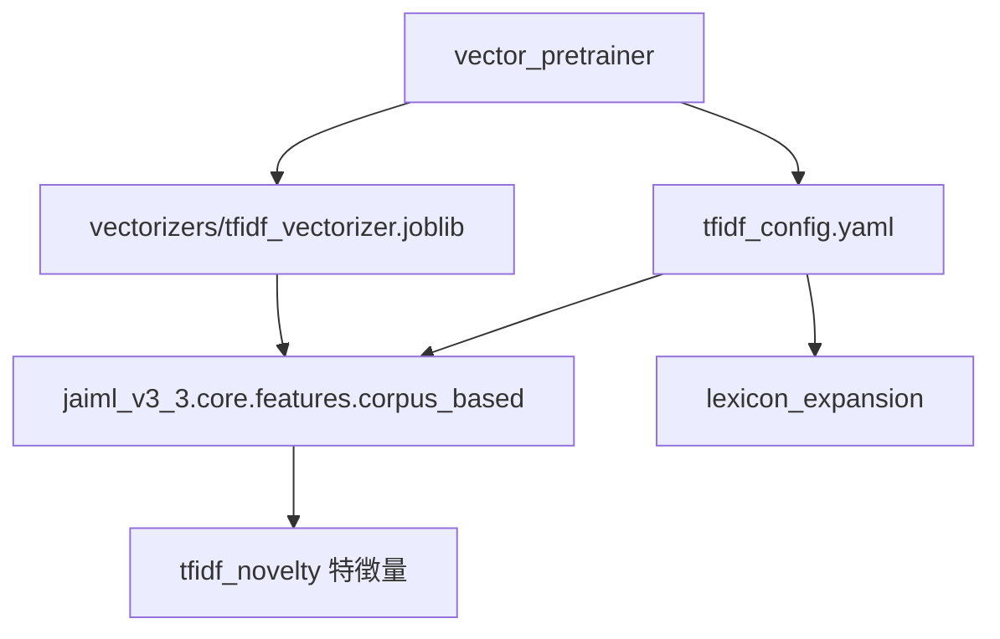

# 📘 JAIML Unified Specification v1.0（統合仕様書）

## 0. 概要

本仕様書は、JAIMLプロジェクトの構成要素である以下の3モジュールの整合性と連携方法を定める：

* **JAIML v3.3**：自己呈示・迎合性分類器の本体モジュール（モデル層）
* **lexicon_expansion v2.0**：辞書拡張・スコア抽出機構（辞書層）
* **vector_pretrainer v1.1**：コーパスベースのベクトル事前学習ユーティリティ（コーパス層）

---

## 1. ディレクトリ構成（`src/` 以下）

```plaintext
src/
├── ci/
├── config/
├── lexicon_expansion/
├── model/
│   ├── jaiml_v3_3/
│   └── vectorizers/
├── vector_pretrainer/
└── requirements.txt
```

各モジュールの責務とデータ流れを以下に図示：



---

## 2. モジュール別要点

### 2.1 vector_pretrainer v1.1

* **目的**：対話コーパスから TF-IDF ベクトルを学習・保存する。
* **入出力形式**：

  * 入力：`corpus/jsonl/*.jsonl`（`user`, `response`, `metadata`）
  * 出力：`outputs/models/tfidf_vectorizer.joblib`, `metadata.json`
* **ハイパーパラメータ**：

  * `ngram_range`, `min_df`, `tokenizer` → `config/tfidf_config.yaml` で定義
  * SRS 検証のため `ci/schema_validate.py` による YAML スキーマ検証を実施
* **保存方式**：

  * `joblib.dump(..., compress=3)`（推奨）
  * `Pickle` は非推奨。警告を出力（security constraint）

### 2.2 JAIML v3.3（model/jaiml_v3_3）

* **目的**：入力テキストから12次元特徴ベクトルを生成し、迎合性を分類する。
* **コア構造**：

  * 特徴量抽出層（`core/features/`）には `corpus_based.py` などが含まれ、TF-IDFノベルティスコアを計算
  * トークン化処理は `utils/tokenize.py` に集約（fugashi 統一）
* **TF-IDF 読み込み**：

  * `TFIDFNoveltyCalculator.load_model(path:str)` により `.joblib` を参照
  * `metadata.json` で `sklearn_version`, `model_version` を検証

### 2.3 lexicon_expansion v2.0

* **目的**：ルールベース辞書に基づく特徴スコア抽出・拡張処理を行う。
* **連携**：

  * TF-IDF スコアによる辞書拡張は `vector_pretrainer` の出力を使用
  * ハイパーパラメータは `config/tfidf_config.yaml` を共用

---

## 3. ハイパーパラメータ構成と統一管理

```plaintext
src/
├── config/
│   ├── global.yaml               # 全体設定（tokenizer, paths など）
│   └── tfidf_config.yaml         # TF-IDF 専用設定（min_df, ngram_range 他）
```

* **検証機構**：

  * `ci/schema_validate.py` により `tfidf_config.yaml` の整合性を CI で検証
  * `tfidf_config_schema.yaml` によって構文・必須項目を保証
* **設定項目例**：

```yaml
tokenizer: fugashi
min_df: 1
ngram_range: [1, 1]
vectorizer_path: model/vectorizers/tfidf_vectorizer.joblib
```

了解、以下に統合仕様書（JAIML Unified Specification）第7章「継続的整合性保証（CI Specification）」の草案を提示するね。
この章は、モジュール横断的な仕様整合・再現性・セキュリティをCIでどう担保するかを明示する目的で設計してある。

---

## 4. 継続的整合性保証（CI Specification）

### 4.1 目的と位置づけ

本システムは、以下の3モジュールから構成される：

* `model/jaiml_v3_3`（本体モデル）
* `lexicon_expansion`（辞書拡張サブシステム）
* `vector_pretrainer`（TF-IDFベクトル事前学習器）

これらは**構成要素間の仕様整合**と**再現性保証**が不可欠であるため、継続的インテグレーション（CI）により次の観点を自動検証する：

* ハイパーパラメータや辞書の**一貫性**
* 特徴量抽出・前処理の**互換性**
* モデル・ベクトルファイルの**整合性と安全性**

---

### 4.2 検証項目一覧

| 検証項目                      | 手法・スクリプト                                    | 目的・効果                                          |
| ------------------------- | ------------------------------------------- | ---------------------------------------------- |
| YAML構成ファイルのスキーマ検証         | `ci/schema_validate.py`（`jsonschema`）       | `tfidf_config.yaml` が `global.yaml` に整合することを保証 |
| ハイパーパラメータの一貫性             | `min_df`, `ngram_range`, `tokenizer`の一致チェック | `vector_pretrainer` 出力が `jaiml_core` と一致する保証   |
| `vectorizer.joblib` の構成検査 | `metadata.json`とscikit-learnバージョンの比較        | バージョン差異による読み込みエラーを事前検知                         |
| Pickle使用の安全性警告            | Linter or `warnings.warn()` 監視              | 任意コード実行リスクのあるPickleの不正使用を回避                    |
| JSONL形式コーパスの構造検証          | JSON parser + フィールド名検査                      | `user`, `response` 形式を持つ構文的な正当性を確認             |
| fugashiトークナイザ統一性          | `tokenize.py` の `fugashi` 依存の確認             | 辞書・マッチングの粒度整合性の保証                              |
| 特徴量のユニットテスト               | `tests/test_features.py` + `pytest`         | 意図された特徴量ロジックが正確に機能することの保証                      |

---

### 4.3 CI実行設計

* **実行契機**：

  * `push`（mainブランチ以外でも）
  * `pull_request`（feature → main）
  * `release` タグ付与時

* **CI基盤**：

  * GitHub Actions を標準とし、以下のワークフローファイルで定義：

    * `.github/workflows/validate.yml`（全体検証）
    * `.github/workflows/tests.yml`（pytestのみ）

* **整合スキーマ**：

  * `config/tfidf_config.yaml`
  * `config/global.yaml`
  * `config/schema/tfidf_config_schema.yaml`

* **CI失敗条件**（一部例）：

  * `min_df` が `global.yaml` と異なる
  * `joblib` ファイルにバージョンメタがない or 整合しない
  * 辞書構造ファイルに重複カテゴリや未定義エントリがある

---

### 4.4 保守運用上の留意点

* CI失敗時はマージ不可とし、**仕様ドキュメントの改定と整合修正を義務付ける**。
* Pickle保存形式が更新された場合は、`metadata.json` と `README.md` にも同時反映する。
* ユニットテストの追加は、特徴量・構文・コーパス仕様の改定時に**セットで行う**こと。

---

## 5. セキュリティ・再現性要件

| 項目           | 要件                                                      |
| ------------ | ------------------------------------------------------- |
| Pickle 安全性   | joblib を推奨し、Pickle 使用時は `trusted_source_only` 警告出力      |
| バージョン整合性     | `metadata.json` に `sklearn_version` 等を記録し、ロード時に一致確認     |
| コーパス匿名化      | `vector_pretrainer/corpus/raw/` に格納後、正規表現＋固有表現フィルタを適用   |
| モデルレジストリ（将来） | `model/vectorizers/registry.json` による BERT 等のバージョン管理案あり |

---

## 6. 拡張・今後の展望

| 領域            | 拡張案                                                |
| ------------- | -------------------------------------------------- |
| Embedding マッチ | `LexiconMatcher` を抽象クラス化し、BERT・SimCSE 埋め込み類似度対応を計画 |
| モデルレジストリ      | モデルバージョンを tags で管理、将来の複数TF-IDF／Transformerモデル共存を想定 |
| コーパスの層別抽出     | SNOW D18 / BCCWJ 対応のため、話者ラベル・話題ドメインのメタデータ化         |
| 高速・安全な deploy | joblib 圧縮レベルチューニング、モジュール別ロード時間ベンチマークを追加            |

---

## Appendix

* `tfidf_config_schema.yaml`（YAML スキーマ定義）
* `metadata.json` サンプル（ベクトライザ情報）
* `vector_pretrainer/corpus/jsonl/sample.jsonl`（user/response/metadata フォーマット）

---

## まとめ

この統合仕様により、**コーパス学習 → 特徴抽出 → 辞書スコア統合 → 推論** までの全流れが一貫性を持って接続され、将来の拡張性と再現性が確保される。プロジェクト参加者はこのドキュメントを起点として、設計・実装・運用を横断的に把握できるようになる。

